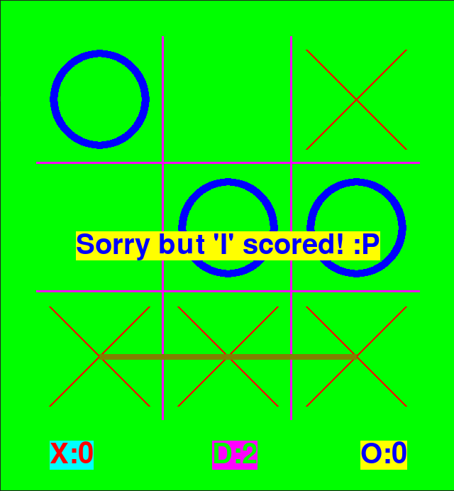

# Brief
A XO (aka tic-tac-toe) one player game with four levels of intelligence using strong AI (nested if statements ;p). 
</img>

# Levels

this game has <b>four</b> levels of intelligence:

<ol>
    <li>Extreme</li>
    <li>Hard</li>
    <li>Medium</li>
    <li>Easy</li>
</ol>

<ul>

<li>

## Extreme

The hardest level of the game. 
you would never win the program in this level. 
(tell me if you succeeded) 

</li>

<li>

## Hard

The second hardest level of the game. 
The third move of the program becomes random. 
Therefore you have a little chance to win. 

</li>

<li>

## Medium

The differences are just like Hard level. 
However just the first move is not random and other moves of the program are random. 

</li>

<li>

## Easy

The moves are tottaly random. 
(tell me if you lost) 

</li>

</ul>

# Requirements
python3.x
pygame
